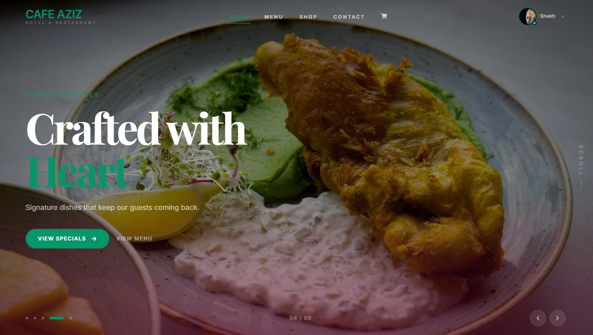

# Cafe Aziz — Hotel & Restaurant Platform

<div align="center">



[](https://cafe-aziz-restaurant-kaptai.web.app)
[](https://md-toyob-hridoy-portfolio.vercel.app)
[](https://www.linkedin.com/in/md-toyob-uddin-hridoy)

</div>

---

## What Is This?

**Cafe Aziz** is a production-ready full-stack MERN application for a hotel & restaurant. It goes beyond a typical demo — it implements real business workflows: table reservations, cart-based food ordering, Stripe payment processing, role-based access control, and both user and admin dashboards backed by a secured REST API.

> Built to show what a real MERN developer actually ships — not just what they know.

---

## 🔐 Test Credentials

| Role  | Email              | Password  |
|-------|--------------------|-----------|
| Admin | admin1@gmail.com   | 123456aA  |
| User  | admin2@gmail.com   | 123456aA  |

---

## ✨ Feature Highlights

### Customer Side
- Browse & filter menu by category (salad, pizza, soup, dessert, drinks)
- Add items to cart, manage quantities
- Complete checkout via **Stripe** (test mode)
- Table reservation system with past-date prevention
- Full order & payment history
- Leave reviews on purchased items
- Personal dashboard with spending analytics

### Admin Side
- Overview dashboard with revenue charts, category breakdown, avg order value
- Add / edit / delete menu items with **Cloudinary** image upload
- Manage all bookings — confirm or cancel with inline item preview
- Promote users to admin or remove them
- Paginated menu management with smart ellipsis pagination

### Auth & Security
- **Firebase Authentication** (email/password)
- **JWT** tokens verified on every protected API route
- Role-based route guards (`PrivateRoute`, `AdminRoute`)
- reCAPTCHA on login to prevent bots

---

## 🛠 Tech Stack

### Frontend
| Tech | Purpose |
|------|---------|
| React 19 + Vite | UI framework & build tool |
| React Router DOM v7 | Client-side routing |
| TanStack React Query v5 | Server state, caching, invalidation |
| Axios | HTTP client with interceptors |
| Tailwind CSS v4 + DaisyUI v5 | Styling system |
| Framer Motion | Animations & transitions |
| React Hook Form | Form state & validation |
| Stripe.js + React Stripe | Payment UI |
| Recharts | Admin analytics charts |
| Firebase SDK v11 | Authentication |
| SweetAlert2 | User confirmations |

### Backend
| Tech | Purpose |
|------|---------|
| Node.js + Express.js | REST API server |
| MongoDB (native driver) | Primary database |
| JWT | Stateless auth tokens |
| Stripe API | Payment intent creation |
| Nodemailer | Email notifications |
| Cloudinary | Image hosting |
| CORS + dotenv | Security & config |

---

## 🏗 Architecture

```
cafe-aziz/
├── client/                    # React + Vite frontend
│   ├── src/
│   │   ├── assets/            # Static images
│   │   ├── components/        # Reusable UI components
│   │   │   ├── FoodCard/
│   │   │   ├── ItemFormPage/
│   │   │   ├── LoadingSpinner/
│   │   │   └── SectionTitle/
│   │   ├── hooks/             # Custom React hooks
│   │   │   ├── useAuthValue.js
│   │   │   ├── useAxiosSecure.js
│   │   │   ├── useCart.js
│   │   │   ├── useAdmin.js
│   │   │   ├── useMenu.js
│   │   │   └── useMyBookings.js
│   │   ├── layout/
│   │   │   ├── Main.jsx       # Public layout
│   │   │   └── Dashboard.jsx  # Protected dashboard layout
│   │   ├── pages/
│   │   │   ├── Home/
│   │   │   ├── Menu/
│   │   │   ├── Order/
│   │   │   ├── Dashboard/
│   │   │   │   ├── Admin/     # AdminHome, AllUsers, ManageItems, ManageBookings
│   │   │   │   └── Customer/  # UserHome, Cart, Payment, PaymentHistory, Reservation
│   │   │   ├── Login/
│   │   │   └── SignUp/
│   │   └── routes/
│   │       ├── router.jsx
│   │       ├── PrivateRoute.jsx
│   │       └── AdminRoute.jsx
└── server/                    # Express REST API
    ├── index.js               # Entry point, all route handlers
    └── .env                   # Secrets (not committed)
```

---

## 🔌 API Overview

All routes under `/dashboard/*` require `verifyToken`. Admin routes additionally require `verifyAdmin`.

| Method | Route | Auth | Description |
|--------|-------|------|-------------|
| GET | `/menu` | Public | Paginated menu with category filter |
| GET | `/menu/:id` | Public | Single item |
| POST | `/menu` | Admin | Add item |
| PATCH | `/menu/:id` | Admin | Update item |
| DELETE | `/menu/:id` | Admin | Delete item |
| GET | `/carts` | User | Get user's cart |
| POST | `/carts` | User | Add to cart |
| DELETE | `/carts/:id` | User | Remove from cart |
| GET | `/payments` | Admin | All payments/bookings |
| POST | `/create-payment-intent` | User | Stripe intent |
| POST | `/payments` | User | Save payment record |
| PATCH | `/order-status/:id` | Admin | Update booking status |
| GET | `/admin-stats` | Admin | Revenue, users, orders |
| GET | `/order-stats` | Admin | Per-category analytics |
| GET | `/user-stats` | User | Personal activity stats |
| GET | `/users` | Admin | All users |
| PATCH | `/users/admin/:id` | Admin | Promote user |
| DELETE | `/users/:id` | Admin | Delete user |
| POST | `/bookings` | User | Create reservation |
| GET | `/bookings` | User | User's bookings |

---

## 📐 Key Engineering Decisions

**Why React Query over Redux?**
The data in this app is server-driven and relatively flat. React Query's automatic background refetching, staleTime configuration, and `invalidateQueries` on mutations eliminated the need for a global store entirely. Every mutation calls `refetch()` or `queryClient.invalidateQueries()` — data is always fresh without manual state syncing.

**Why JWT + Firebase together?**
Firebase handles the authentication UX (sign in, Google OAuth, session persistence). JWT handles API authorization — on login, the server issues a token stored in `httpOnly`-style local storage, attached to every Axios request via an interceptor in `useAxiosSecure`. This separates concerns cleanly: Firebase owns identity, JWT owns authorization.

**Why MongoDB native driver over Mongoose?**
For a project of this scope, the native driver gives more transparent control over aggregation pipelines — the `/order-stats` and `/admin-stats` endpoints use `$unwind`, `$lookup`, `$group`, and `$project` stages that are more readable without Mongoose's abstraction layer.

**Cloudinary over multer + local storage?**
Images uploaded through the admin panel go directly to Cloudinary from the client using a signed upload preset. The server never handles binary file data — it only stores the returned CDN URL. This keeps the server stateless and the images fast.

---

## ⚙️ Local Setup

### Prerequisites
- Node.js 18+
- MongoDB Atlas URI
- Firebase project credentials
- Stripe secret key
- Cloudinary account

### Client

```bash
cd client
npm install
```

Create `client/.env.local`:
```env
VITE_apiKey=your_firebase_api_key
VITE_authDomain=your_project.firebaseapp.com
VITE_projectId=your_project_id
VITE_storageBucket=your_project.appspot.com
VITE_messagingSenderId=your_sender_id
VITE_appId=your_app_id
VITE_Cloudinary_Image_Hosting_key=your_cloudinary_cloud_name
VITE_CloudImageUser=your_upload_preset
VITE_Payment_Gateway_PK=pk_test_your_stripe_public_key
```

```bash
npm run dev
```

### Server

```bash
cd server
npm install
```

Create `server/.env`:
```env
DB_USER=your_mongodb_user
DB_PASS=your_mongodb_password
ACCESS_TOKEN_SECRET=your_jwt_secret
STRIPE_SECRET_KEY=sk_test_your_stripe_secret_key
EMAIL_USER=your_gmail
EMAIL_PASS=your_app_password
```

```bash
npm run dev
```

---

## 🚀 Deployment

- **Client** → Firebase Hosting (`npm run deploy`)
- **Server** → Render / Railway (auto-deploy via GitHub Actions — see `.github/workflows/`)

---

## 👨‍💻 Developer

**Md. Toyob Uddin (Hridoy)**
Full-Stack MERN Developer · Chittagong, Bangladesh

I build production-grade web applications with React and Node.js, with a strong focus on clean architecture, real business logic, and polished UI. I don't build toy projects — every app I ship reflects how I'd work in a team.

[](https://md-toyob-hridoy-portfolio.vercel.app)
[](https://www.linkedin.com/in/md-toyob-uddin-hridoy)
[](https://github.com/Hridoykhan4)

---

## 📄 License

MIT — use freely, attribution appreciated.

---

<div align="center">
  <sub>If this project demonstrates the kind of developer you're looking for — let's connect.</sub>
</div>